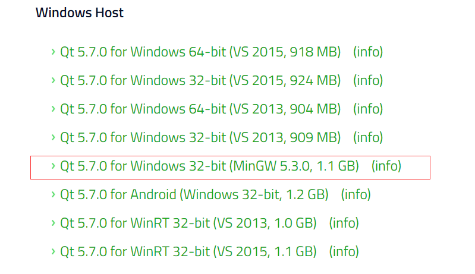
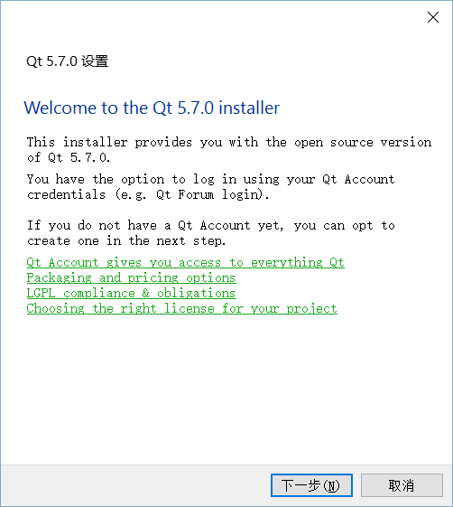
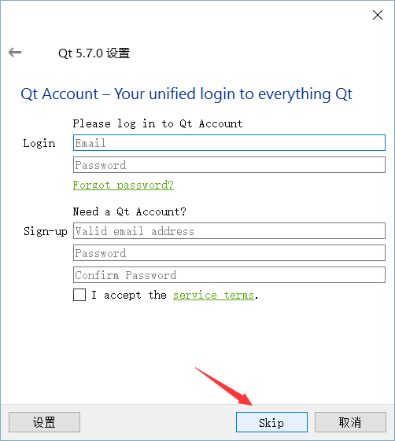
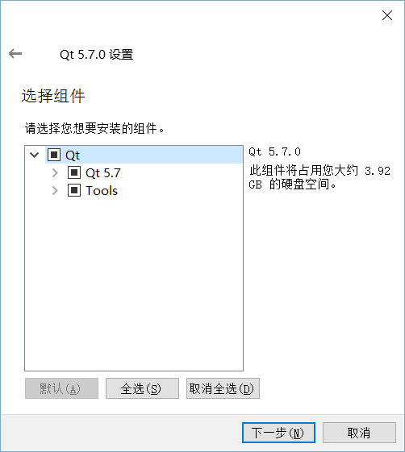
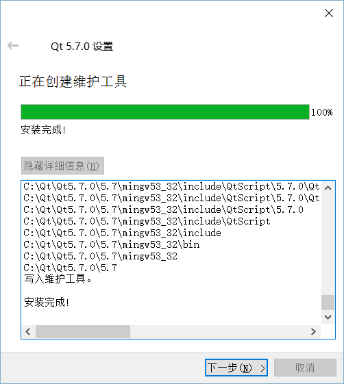
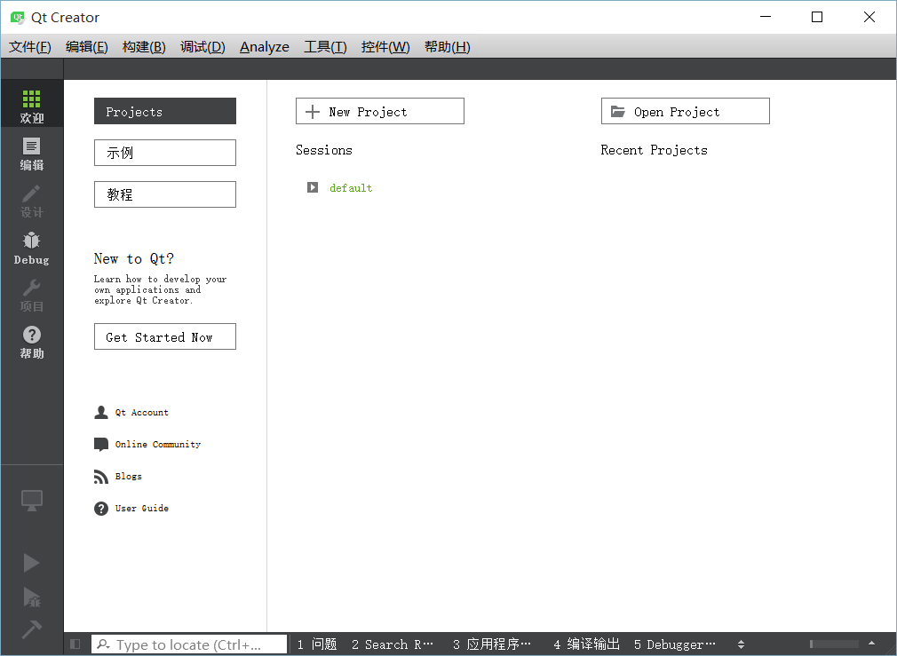
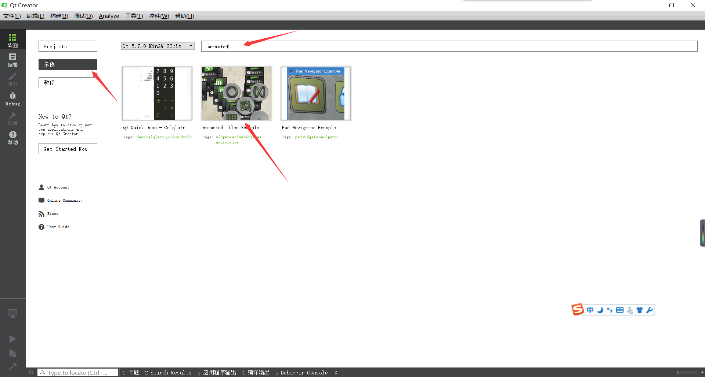
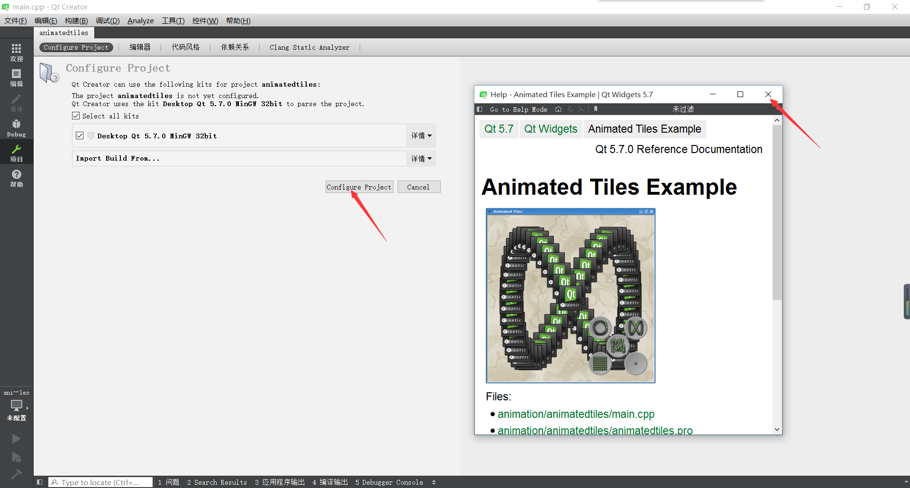
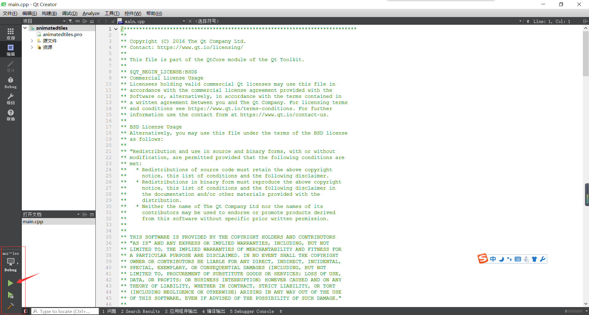
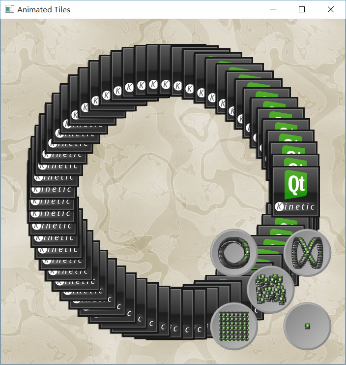

# Windows下QtCreator安装教程

    **多图大图预警，已经点开了的反正你都点开了，不如就看完吧！**

### 下载Qt

0. 你可以直接将[http://download.qt.io/official_releases/qt/5.7/5.7.0/qt-opensource-windows-x86-mingw530-5.7.0.exe](http://download.qt.io/official_releases/qt/5.7/5.7.0/qt-opensource-windows-x86-mingw530-5.7.0.exe)复制到迅雷或其他下载器中下载，大小1.1G。

    如果你是直接从这个链接下载的，那么久可以直接跳到安装环节了。

1. 进入[Qt官网](https://www.qt.io/)（需要特别注意不要把Qt和腾讯的QT搞混了）

1. 鉴于在Qt官网上找下载链接还挺麻烦的，所以我这里直接把下载链接的网址给出

    [https://www.qt.io/download-open-source/#section-2](https://www.qt.io/download-open-source/#section-2)

1. 向下翻查，找到Windows版本

    

    这个链接就是我们的下载链接了。

### 安装Qt

1. 找到之前下载的文件，双击打开。

    

1. 按照提示，全部默认就可以了。

    

    

    注意，这里提示我们登录账号，直接跳过就可以。

    

    

    等几分钟之后就安装好了。

### 运行示例

1. 安装好之后，从开始菜单中运行Qt

    

1. 点击“示例”，在搜索框中输入"animated"，找到第二个示例，点击打开

    

1. 然后可以看到配置界面，直接使用默认配置就可以

    

1. 然后会跳到代码界面，注意左下角的几个图标，过一段时间后，图标会变换成绿色，然后就可以点击运行了

    

1. 现在我们的示例就可以运行起来了

    

    点击右下角的几个按钮会有惊喜哦！