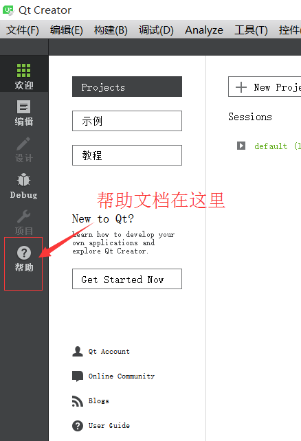
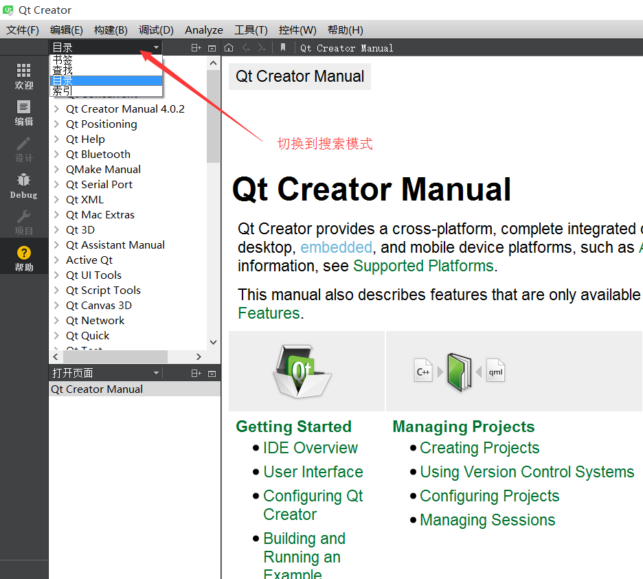
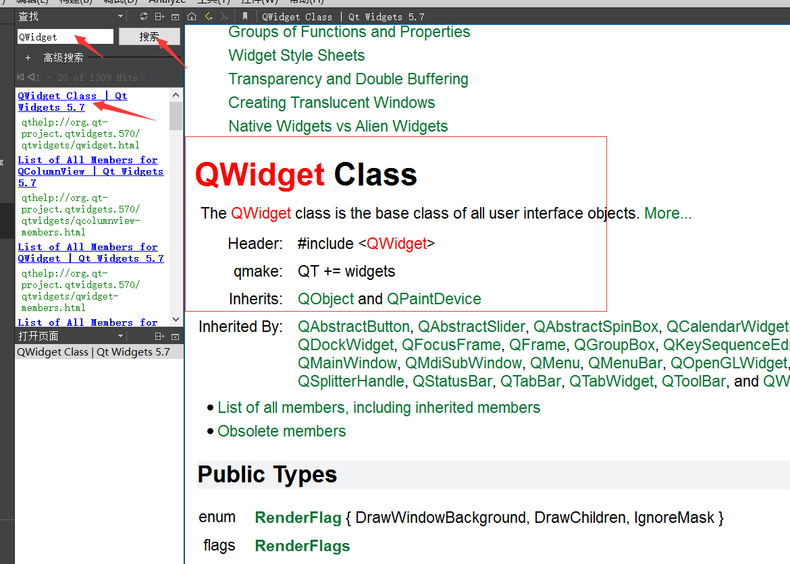
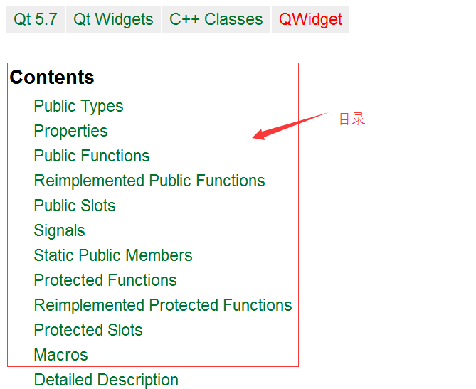
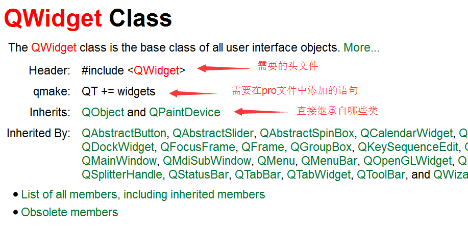
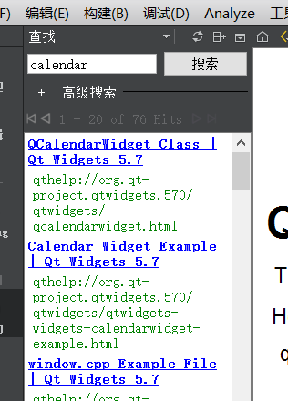
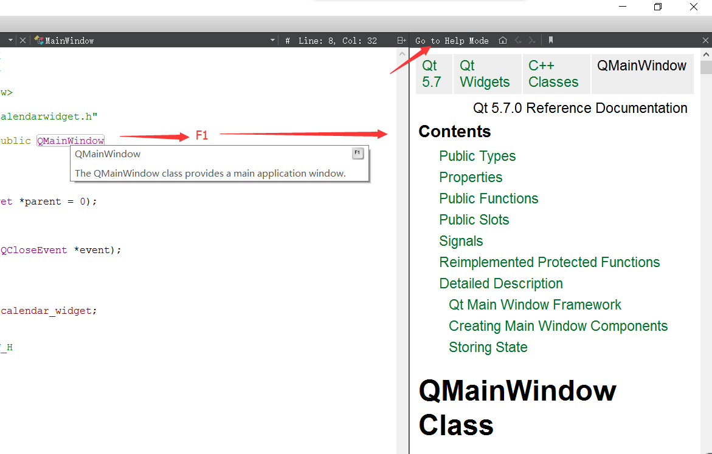

# QtCreator帮助文档使用教程

### 帮助文档在哪儿？

帮助文档就在QtCreator左边导航栏的最下面一个图标

### 使用搜索功能

### 类的帮助文档

1. 目录
    
    

1. 类的基本信息

    

    需要特别注意header和qmake一项

1. 其他属性

    包括“公共类型”，“公有成员变量”，“公有成员函数”，“信号”，“槽”,“静态函数”，“受保护的函数”等等。

### 其他帮助信息

在搜索功能处，可以搜索其他东西，比如“calendar”，会列出相关的一些条目。

### 在代码编辑器中使用帮助文档

将光标移到需要查找帮助文档的地方，按`F1`，就会在右边跳出一个小型的帮助文档界面。

点击小型文档左上角的按钮，就可以切换到大文档模式。

需要注意的是：这种方法不止可以查看类的帮助文档，还可以查看具体某个函数的帮助文档。

### 推荐几个图标网站

* [http://findicons.com/](http://findicons.com/)

* [http://www.easyicon.net/](http://www.easyicon.net/)

* [http://www.iconpng.com/](http://www.iconpng.com/)