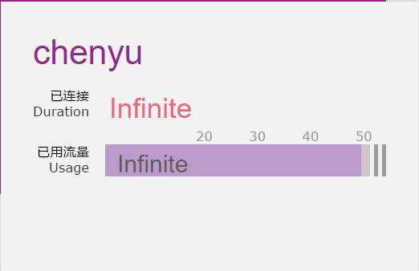
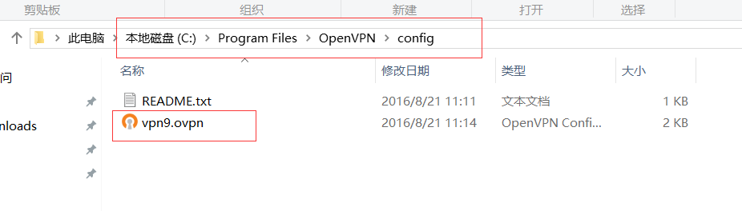
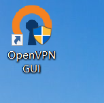
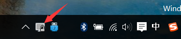
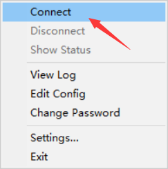
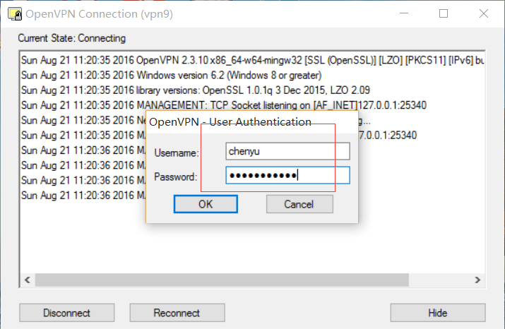
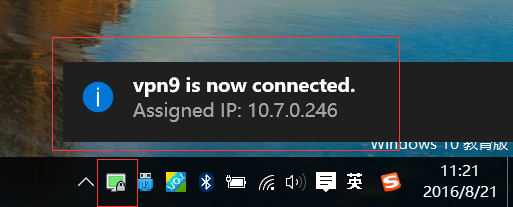
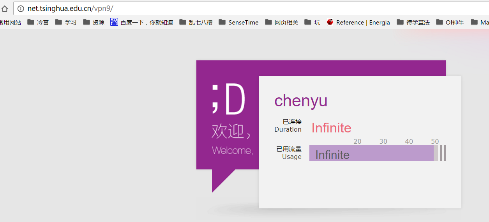

# 使用科协VPN9实现免流量上网

### 科协VPN9是什么？ {#what}

邈叔：“VPN9只是给大家提供一个免流量上网的方式，不提供其他服务。你们这样乱说，将来报道上出了偏差，你们可是要负责的！”

众人：+1s

### 先决条件 {#requires}

要使用VPN9，你需要满足以下条件：

* 有一个[A9](https://accounts.net9.org/)账号
* 该A9账号需要是某科协组的成员（就是说需要加入科协）
* 一台可以运行OpenVPN的设备（电脑，手机，部分路由器均可）

### Windows下搭建VPN9 {#windows}

1. 首先，你需要下载安装OpenVPN

    你可以选择从[官网](http://openvpn.ustc.edu.cn/)下载，或者直接从<a href="files/openvpn-install-2.3.10-I601-x86_64.exe" target="_blank">此处</a>下载。

    下载好之后，直接安装即可，需要特别注意安装的路径（在我的Windows10电脑上安装路径是C:\Program Files\OpenVPN）。

1. 然后，你需要下载VPN9的配置文件

    进入[https://vpn.net9.org/](https://vpn.net9.org/)下载，或者直接从<a href="files/vpn9.ovpn" target="_blank">此处</a>下载。

    然后，将配置文件拷贝到之前安装OpenVPN目录下的config子目录下：

    

1. 最后，打开OpenVPN，输入用户名和密码

    从桌面上打开OpenVPN

    

    打开之后，你会在屏幕右下角的系统托盘处看到OpenVPN的图标

    

    右击该图标，点击Connect

    

    然后会弹出一个窗口，输入[A9](https://accounts.net9.org/)用户名和密码就可以了

    注意：此处输入的是[A9](https://accounts.net9.org/)的账号，并不是登录info的账号

    

    链接成功之后，左下角会弹出提示，OpenVPN的托盘图标颜色也会改变

    

    打开浏览器，进入[http://net.tsinghua.edu.cn](http://net.tsinghua.edu.cn)，可以看到确实不限流量了

    